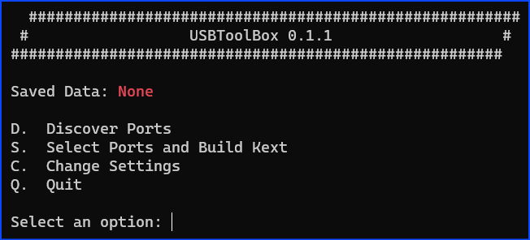
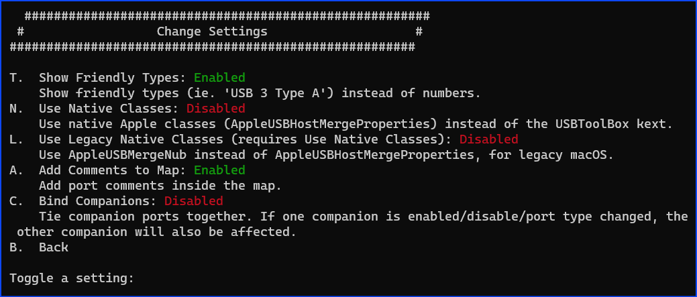
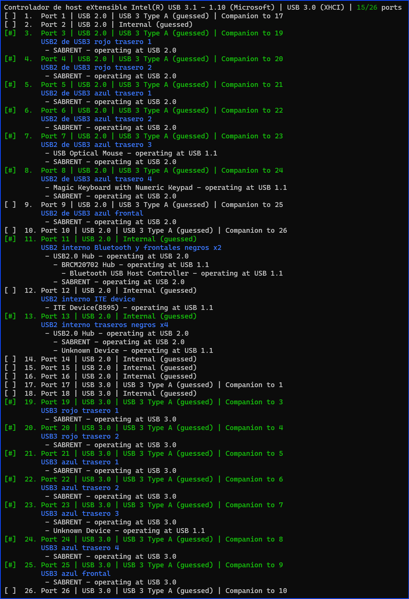
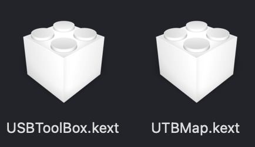

# Mapa de puertos USB para macOS con USBToolBox desde Windows

[(English version)](README-EN.md)

### Resumen

Generar el mapa de puertos USB en Windows para ser utilizado en macOS, que tiene un límite de 15 puertos por controlador USB, mediante la herramienta USBToolBox de [dhinakg](https://github.com/dhinakg). Actualmente, este es el método más sencillo de generar el mapa de puertos USB para macOS con el único inconveniente de que necesita un sistema Windows en la misma máquina.

No he encontrado instrucciones en español, este artículo intenta subsanar esta carencia.

### Descarga las herramientas

En el [sitio](https://github.com/USBToolBox) de GitHub tienes la herramienta para Windows (tool >> Releases >> Windows.zip). Por ahora es todo lo que necesitas.

### Crea el mapa de puertos

En la carpeta descomprimida, ejecuta Windows.exe. Se abre una ventana de comandos en la que tiene lugar todo el proceso.

**Letra C** para acceder a la configuración

Aquí solamente habilito 2 opciones: *Show Friendly Types* (facilita la lectura de los puertos detectados) y *Add Comments to Map* (permite añadir comentarios identificativos a cada puerto como por ejemplo «USB3 azul trasero»).

**Letra D** para mostrar todos los puertos detectados por la herramienta

Casi todas las placas base que tenemos en los Hackintosh tienen más de 15 puertos que es el tope máximo tolerado por macOS. En mi caso, hay 26 puertos. Si uso macOS tal cual, sin mapa de puertos, algunos se van a activar y otros no, probablemente algunos van a funcionar con velocidad incorrecta y casi con toda seguridad la función de reposo (y otras probablemente) no va a funcionar bien. Por ello es necesario generar el mapa, para dejar definidos los 15 puertos que vamos a tener activos en macOS y que serán los únicos que podremos utilizar.

Observa que los puertos que tienen algún dispositivo conectado están en verde y el resto están en blanco.

En esta fase necesitas un dispositivo USB de tipo 2 y otro de tipo 3. Yo he recurrido a un disco externo USB3 y 2 cables para conectarlo al PC de los que uno es USB2 y otro es USB3. Sirven también 2 memorias USB, una USB2 y otra USB3.

* Empiezas con el dispositivo USB2 y al finalizar repites con el USB3 (o a la inversa)
* Lo vas conectando en cada uno de los puertos, sean USB2 o USB3, hasta comprobar que aparece en la lista de puertos
* Al quitar el dispositivo, también desaparece de la lista pero queda guardado para el paso siguiente
* Al terminar con ambos dispositivos, letra B para volver al menú anterior.

**Letra S** para elegir los puertos y construir la extensión (kext)

En la lista, cada puerto en el que conectaste un dispositivo lo tiene asociado. Además de los que ya tenían alguno conectado (los que están en verde)
Aquí puedes detenerte en dar nombre a los puertos que vas a elegir, para ello escribes c:x:nombre siendo x el número del puerto y nombre el que quieres darle (pueden ser varias palabras)
Llega la hora de hacer la selección. Lo más cómodo es usar N para deseleccionar todos los puertos y después escribir la lista numérica de los elegidos en la forma 1,2,3,4,5 sin superar los 15 puertos.
Al final, la lista muestra cuáles son los 15 puertos elegidos y el comentario que hemos escrito en cada uno de ellos.

**Letra K** para generar UTBMap.kext

Esta es la extensión que macOS va a utilizar. No funciona por sí sola sino que ha de ir acompañada de la extensión USBToolBox.kext descargada desde el mismo sitio de GitHub. Ambas juntas en la carpeta Kexts de OpenCore o Clover. En el archivo config.plist, USBToolBox.kext ha de ir antes de UTBMap.kext.

Una ventaja adicional que tiene este método sobre USBMap.kext de [corpnewt](https://github.com/corpnewt) o USBPorts.kext de la herramienta [Hackintool](https://github.com/benbaker76/Hackintool) de macOS es que no depende del modelo SMBIOS, en estas hay que modificar el archivo Info.plist de la extensión al cambiar de modelo de Mac.
